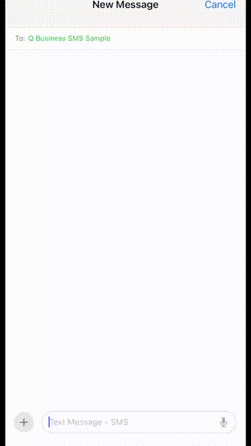
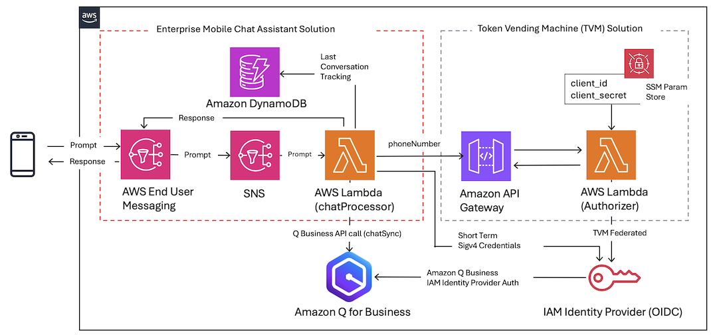

# Enterprise Mobile Chat Assistant

>**BE AWARE:** This code base is an [Open Source](LICENSE) starter project designed to provide a demonstration and a base to start from for specific use cases. 
It should not be considered fully Production-ready.
If you plan to deploy and use this in a Production environment please review the [Using this in Production](#using-this-in-production) section at the end for some additional guidance.

## Use-case scenario

This solution demonstrates how you can use AWS End User Messaging 2-way SMS to send and receive messages with Amazon Q for Business.  It allows your end users from mobile phones to get answers to questions, get summaries, receive generated content and complete tasks based on your enterprise system data provided through Amazon Q for Business. 

## Solution components

On a high-level, the solution consists of the following components, each contained in a separate folder:

* cdk-stacks - AWS CDK stacks:
    - `cdk-backend-stack` with all the backend resources needed for the solution (AWS Lambda, Amazon API Gateway, Amazon Cognito etc)

### Solution architecture:  
  

## Solution prerequisites
* AWS Account
* AWS IAM user with Administrator permissions
* [Docker](https://www.docker.com/) Installed and Running - This is used locally to package resources for deployment.
* Node (> v18) and NPM (> v8.19) [installed and configured on your computer](https://nodejs.org/en/download/package-manager)
* AWS CLI (v2) [installed and configured on your computer](https://docs.aws.amazon.com/cli/latest/userguide/getting-started-install.html)
* AWS CDK (v2) [installed and configured on your computer](https://docs.aws.amazon.com/cdk/v2/guide/getting_started).
* An [ACTIVE SMS Origination Phone Number provisioned](https://docs.aws.amazon.com/sms-voice/latest/userguide/phone-numbers-request.html) in AWS End User Messaging SMS. Note: This must be an Active number that has been registered. Within the US, you can use 10DLC or Toll Free Numbers (TFNs).
* [Amazon Q Business - Token Vending Machine(TVM) solution](https://github.com/aws-samples/custom-ui-tvm-amazon-q-business) deployed into your account. You will only need TVM solution deployed and won't need to run the sample React app. This solution will leverage TVM to generate secure credentials for accessing Amazon Q Business APIs.
* Amazon Q Business application created from following the TVM solution steps (AWS IAM Identity Provider needs to be selected for access management method). If you are new to Amazon Q Business, start from [Getting started with Amazon Q Business](https://docs.aws.amazon.com/amazonq/latest/qbusiness-ug/getting-started.html) to setup the application.

## Solution setup

The below instructions show how to deploy the solution using AWS CDK CLI.
These instructions assume you have completed all the prerequisites, and you have an existing Amazon Connect instance, SSO/SAML enabled.

> Note:If you are using a Windows device please use the [Git BASH](https://gitforwindows.org/#bash) terminal and use alternative commands where highlighted.

1. Clone the solution to your computer (using `git clone`)

2. Check AWS CLI
    - AWS CDK will use AWS CLI local credentials and region. These can be either
      - environment variables (AWS_ACCESS_KEY_ID AWS_SECRET_ACCESS_KEY, AWS_SESSION_TOKEN, AWS_DEFAULT_REGION) set directly in the command line
      - from a [credentials file](https://docs.aws.amazon.com/cli/latest/userguide/cli-configure-files.html), either using the default profile or setting a specific one (i.e. `export AWS_PROFILE=yourProfile`)
    - check your AWS CLI configuration by running any AWS CLI command (e.g. `aws s3 ls`)
    - you can confirm the configured region with  
            `aws ec2 describe-availability-zones --output text --query 'AvailabilityZones[0].[RegionName]'`
    - AWS SDK (used in the configure script in step 4) can use either the environment variables or credentials file/profile config, however note that the region environment variable in this case is AWS_REGION rather than AWS_DEFAULT_REGION (as used in awscli)

3. Install NPM packages
    - Open your Terminal and navigate to `enterprise-mobile-chat-assistant/cdk-stacks`
    - Run `npm run install:all`
    - This script goes through all packages of the solution and installs necessary modules (webapp, cdk-stacks, lambdas, lambda-layers)

4. Configure CDK stacks
    - In your terminal,  navigate to `enterprise-mobile-chat-assistant/cdk-stacks`
    - Start the configuration script in interactive mode   
      `node configure.js -i`
    - (You can configure it via single command, by directly providing parameters, as described in the script help instructions which you can see by running 
      `node configure.js -h`)
    - When prompted, provide the following parameters:

        - `origination-number-id`: The ID of the Origination Phone number you want to use.  Can be found in the AWS End User Messaging SMS console by clicking on `Configurations -> Phone numbers` and selecting the phone number you want to use.  The ID is the `Phone number ID` column.  NOTE: This number shouldn't be part of a Phone Pool and shouldn't have 2-WAY SMS previously enabled.
        - `vite-issuer-url`: Issuer URL deployed from TVM (Token Vending Machine) solution.  Can be found in the Cloudformation stack output as 'IssuerUrlOutput'.
        - `vite-iam-assume-role-arn`: IAM assume role ARN deployed from TVM (Token Vending Machine) solution.  Can be found in the Cloudformation stack output as 'QBizAssumeRoleARN'.
        - `q-business-application-id`: Application ID of Amazon Q Business application.  Can be found in the Q Business console.
        

5. Deploy CDK stacks
    - In your terminal navigate to `enterprise-mobile-chat-assistant/cdk-stacks`
    - If you have started with a new environment, please bootstrap CDK: `cdk bootstrap`
    - Run the script: `npm run cdk:deploy`
        - On **Windows devices** use `npm run cdk:deploy:gitbash`
    - This script deploys CDK stacks
    - Wait for all resources to be provisioned before continuing to the next step
    - AWS CDK output will be provided in your Terminal.

6. Test the solution
    - Using SMS, send `start` to the AWS End User Messaging Phone Number you selected. You should receive a response from the solution with instructions to proceed with the demo. 

## Clean up

To remove the solution from your account, please follow these steps:

1. Remove CDK Stacks
    - Run `cdk destroy --all`

2. Remove deployment parameters from AWS System Manager Parameter Store
    - Run `node configure.js -d`

## Using this in Production

It is critical that before you use any of this code in Production that you work with your own internal Security and Governance teams to get the appropriate Code and AppSec reviews for your organization. 

Although the code has been written with best practices in mind, your own company may require different ones, or have additional rules and restrictions.

You take full ownership and responsibility for the code running in your environment, and are free to make whatever changes you need to.

**Some of the things you will want to consider**
- The pricing for Amazon Q for Business is based on subscription per unique user. You may want to restrict the usage for unexpected by restricting the phone number to be accessible. See https://aws.amazon.com/q/business/pricing/
- Amazon Q for Business Guardrails - A customer may want to restrict Q Business output for compliance, abuse mitigation, or other data restrictions. See https://docs.aws.amazon.com/amazonq/latest/qbusiness-ug/guardrails.html
- The starter project has extensive logging to CloudWatch, but does not have any monitoring or tracing included, you may want to look at using tools like Cloudwatch Alarms and X-ray.
- The starter project tags all resources with the tags listed in `cdk-stacks/config.params.json` and anything created through the dashboard has the tags in `cdk-stacks/lambdas/constants/Tags.js` added. You may wish to replace them with your own company requirements, or tag at a more granular level.